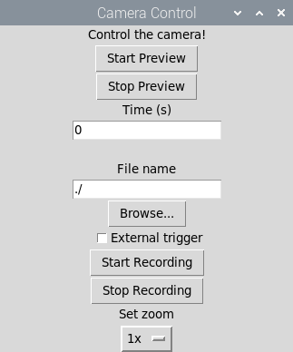
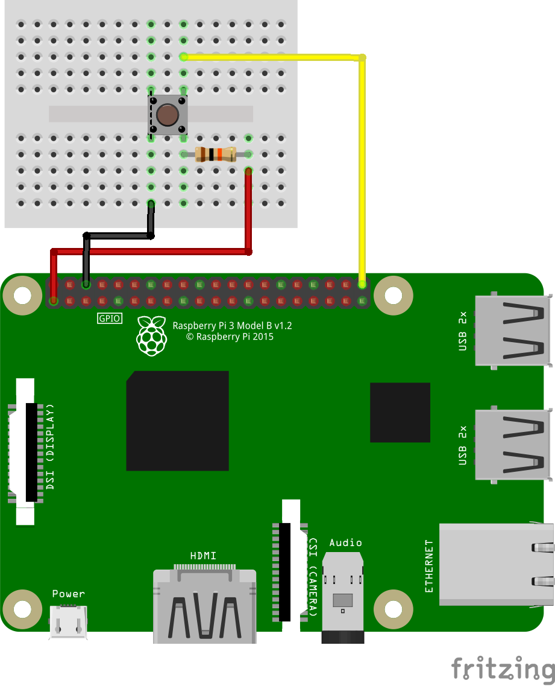

# Usage of the camera guided user interface (GUI)

## Introduction
This is a guide to the graphical user interface (GUI) installed to '/home/pi/Code/pupillometry-raspi/'. The GUI lets you control the camera without having to issue any commands via command line. The following steps will show you how to use CamGUI.py with its various optional parameters.

## Basic instructions
In order for the camera GUI to start, both the camera and the BrightPi need to be connected to the raspberry (see the [assembly guide](./ASSEMBLY.md) for more information on how to get set up).
When everything is connected properly, the GUI is started by typing the following in a terminal window.

```bash
# Start CamGUI.py from its folder
python /home/pi/Code/pupillometry-raspi/CamGUI.py
```

### GUI controls
<p align="center">
  
</p>

### Simple recording
Because of the way Raspbian overlays the live video feed with the screen, it can happen that the GUI window is covered by the video feed. In that case, press `CTRL + c` to terminate the GUI.


For a simple recording, start CamGUI.py with the above command and press "Start Preview". Now adjust camera position and focus. If you want to see video on the screen during your recording, simply leave the preview on and press "Start Recording". The camera will now record to the directory shown in terminal until "Stop Recording" is pressed. The default filename is constructed from the date and time of the recording. You can also specify a custom location and name to store the video in the "File name" dialog box or via the "Browse..." button.

### Timed recording
If you want the recording to run for a specified amount of time, enter the time in seconds into the dialogue box. Open the preview and press "Start Recording". A timer showing the remaining time will be displayed in the terminal window from which CamGUI.py was started. The recording will stop automatically after the specified amount of time.

## Optional parameters
CamGUI.py can be started with optional parameters in the following format, without the brackets.

```bash
# Start CamGUI.py with optional parameters
python /home/pi/Code/pupillometry-raspi/CamGUI.py --[PARAMETER] [VALUE]

# Example with a larger video preview window
python /home/pi/Code/pupillometry-raspi/CamGUI.py --prevsize 700

# Example with large preview and low frame rate
python /home/pi/Code/pupillometry-raspi/CamGUI.py --prevsize 700 --framerate 5
```

Valid parameters are:

+ `--fullscreen` shows preview in full screen mode. This parameter needs no value. (Default = False)
+ `--trigger_pin PIN` specifies the input trigger pin number. (Default = 40)
+ `--light_off` disables light source. Used when no BrightPi is attached. This parameter needs no value. (Default = False)
+ `--prevsize S` scales preview to custom width S. (Default = 320)
+ `-r R` or `--framerate R` sets a custom frame rate R. (Default = 30)
+ `--rotation ROT` sets the image rotation ROT in degrees. (Default = 180)
+ `--timeout T` sets the timeout T when waiting for a trigger, in seconds. (Default = 20)
+ `--sensor_mode N` sets the sensor mode. N can be one out of [1-7]. Refer to the PiCamera [docs](https://picamera.readthedocs.io/en/release-1.12/fov.html#camera-modes) for an overview of different modes. (Default = 1)

## External triggering
CamGUI.py can accept external triggers on pin 40 (GPIO 21), or any other GPIO specified with `--trigger_pin`. When the appropriate box is ticked and once "Start Recording" is pressed, CamGUI.py will wait for the time specified with `--timeout` (default = 20 seconds) for the trigger to arrive, i.e. the pin to be pulled low. See below for an example with a push button between GND and GPIO21.

<p align="center">
  
</p>

External triggering is also an easy way to synchronize recordings from two or more pupillometry setups. For example when simultaneously recording both eyes, or monitoring the breathing rate.

## Start CamGUI.py via an executable
CamGUI.py can also be started from an executable file placed on the desktop, for example. Follow below steps to create such a file.

```bash
# Open an editor via terminal
sudo nano /home/pi/Desktop/start_camera.sh
```

Then enter the following lines. Add optional parameters as needed.

```bash
#!/bin/sh
python /home/pi/Code/pupillometry-raspi/CamGUI.py
```

Type `CTRL + o` to save and `CTRL + x` to exit. Now, run the below command to make the file executable.

```bash
sudo chmod +x /home/pi/Desktop/start_camera.sh
```

[Home](./index.html)
