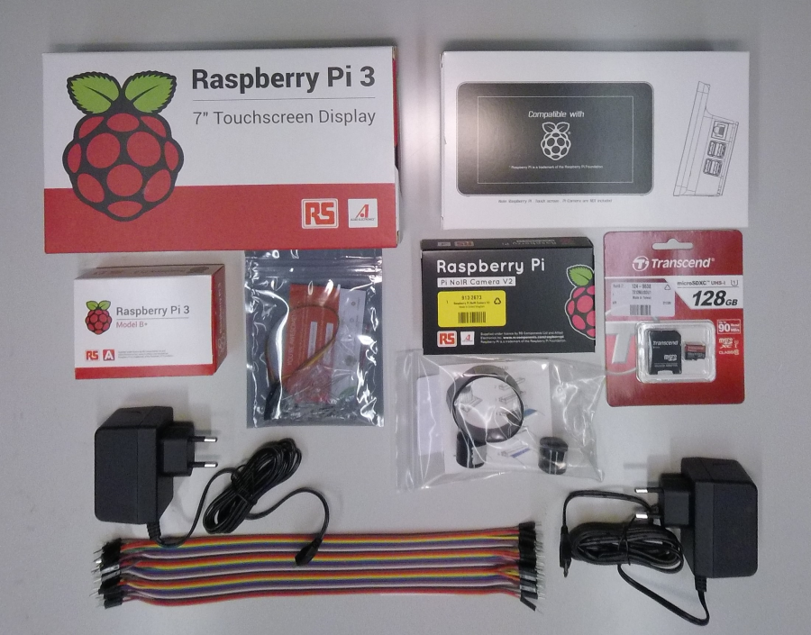
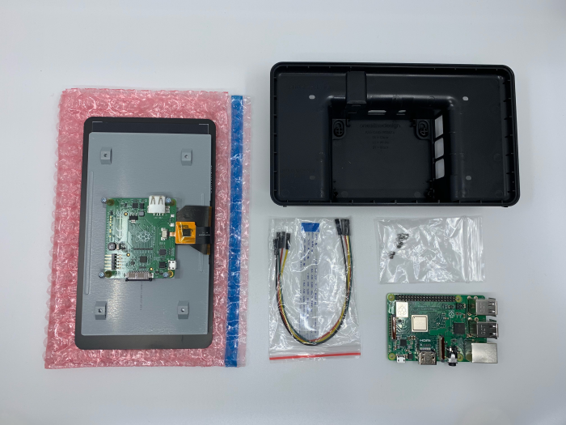
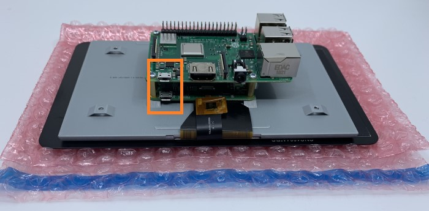
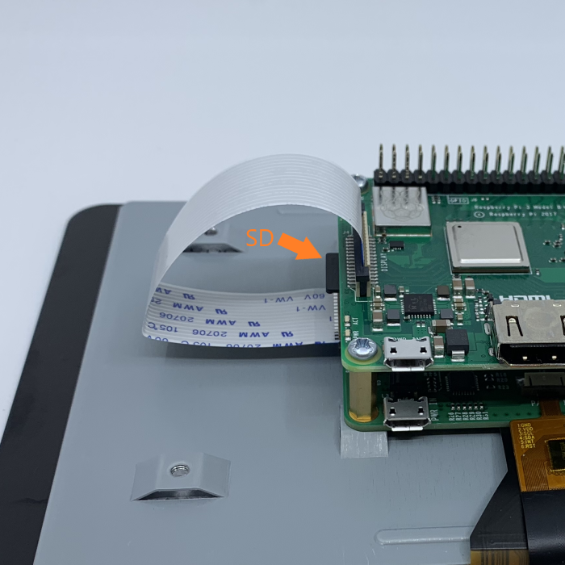
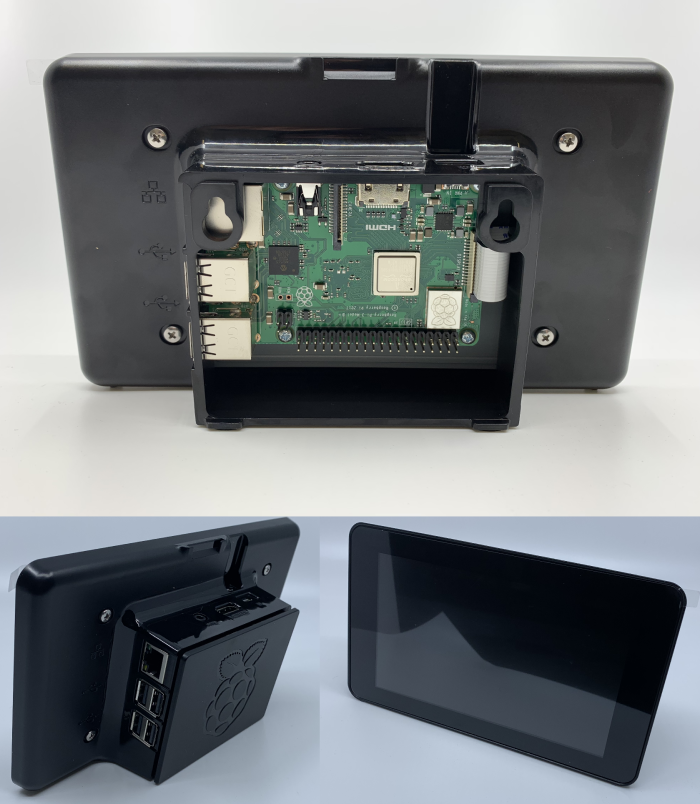
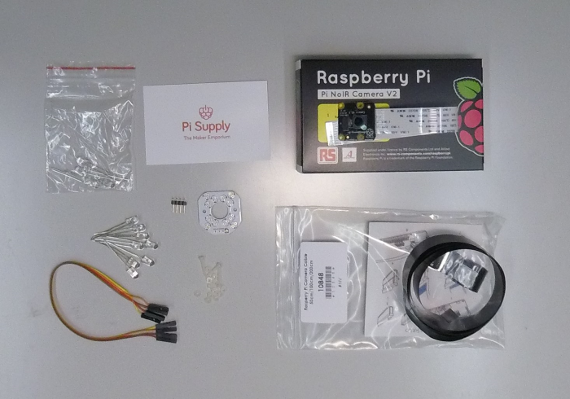
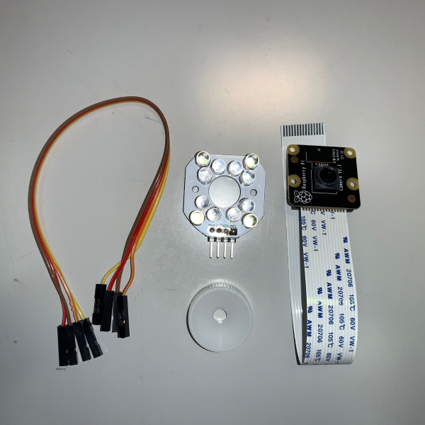
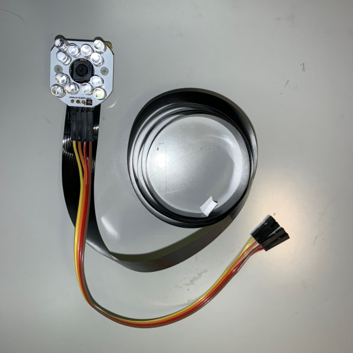
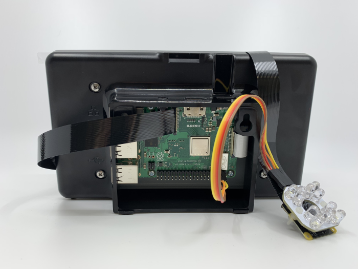

# A miniaturized pupillometry setup?

Alternative titles: ...

## Introduction
The following steps will guide you through the process of building, programming and using a cheap and reliable pupillometry setup, as presented in [Names et al., (2019), etc. bla bla](https://link.to.pub).

## Background
Why is this useful. What lead us to pursue this? What's already out there?
* Cost-effectiveness & range of alternatives
* Scalability
* Open source & open hardware -> Availability
* Simplicity
* ...

## Bill of Materials (BOM)
The following components are needed before starting the assembly process. Please be aware that we built and tested the setup with below linked components. However, many of these can probably be replaced with similar hardware. Also, the touch screen is not strictly required, as the Pi can also be controlled through another computer via an SSL connection. However, it makes the setup more user friendly and accessible.



#### Main Hardware
* [Raspberry Pi 3 B+](https://ch.rs-online.com/web/p/entwicklungskits-prozessor-mikrocontroller/1373331/)
* [Raspberry Pi Touchscreen (optional, but recommended)](https://ch.rs-online.com/web/p/entwicklungskits-grafikdisplay/8997466/)
* [Pi + Touchscreen housing (optional, but recommended)](https://ch.rs-online.com/web/p/raspberry-pi-gehause/9064665/)
* [Raspberry Pi NoIR Camera V2](https://ch.rs-online.com/web/p/videomodule/9132673/)
* [Pi Supply Bright Pi (or similar IR light source)](https://www.pi-shop.ch/pi-supply-bright-pi-bright-white-und-ir-kamera-licht-fuer-raspberry-pi)
* [CSI Flex Cable ca. 1m](https://www.pi-shop.ch/raspberry-pi-camera-cable-50cm-100cm-200m)
* [2x Power Supply](https://ch.rs-online.com/web/p/ac-dc-adapter/1770223/)
* [SD Card (>= 16GB)](https://ch.rs-online.com/web/p/sd-karten/1249638/)
* [USB Stick (optional)](https://ch.rs-online.com/web/p/usb-sticks/8659155/)
* [USB Keyboard (optional)]()

#### Tools
* Screwdriver
* Soldering iron
* Play dough
* SD Card adapter
* Computer to flash SD card


## Preparation

## Safety

## Assembly

#### SD Card Setup

First, download [Etcher](https://www.balena.io/etcher/) and install it on the Computer that will be used to write the SD card image. Download the latest  [Raspbian image](https://downloads.raspberrypi.org/raspbian_full_latest) and follow below steps to write the image.

1. Open Etcher and select the downloaded image under "Select image"
2. Insert your SD card into the card reader and select it under "Select drive". Make sure you selected the SD Card and no other USB or internal drive.
3. Hit "Flash!" to write to the card

In case you experience any trouble writing the image, please re-format your SD card and try again.

#### Assemble Touchscreen + Raspberry Pi


First, place the Raspberry on the brass spacers of the touch screen board. Make sure the micro-USB connectors on both boards are aligned (see picture below) and fasten the Raspberry with the four Phillips screws provided.



Install the SD card now with the pins facing the Raspberry's PCB. Also, install the short display cable that came with the touch screen. Make sure the metal contacts on the ribbon cable are facing towards the contacts in the socket, and away from the black bracket. Ignore the 4 colored cables that shipped with the touch screen. These are only needed if you use a really old Raspberry Pi and/or if you plan to power the Raspberry from the screen directly. This option is not recommended, as screen, camera and light need more power than a single average power supply can provide. This can lead to unexpected behavior.

Please, be aware that this part of the assembly will likely not be accessible anymore once it's inside the housing.



Now install the housing and secure it with the provided screws. Ensure correct orientation of assembly.



#### Assemble Light and Camera



We recommend using an original Raspberry NoIR V2 camera, because they come without an infrared light filter. This is crucial for measuring pupil diameter, as the iris reflects infrared light and therefore a maximal contrast between pupil and iris can be achieved. You can also use a third party "night vision" camera for the raspberry.

Assemble the Bright Pi light source following the official [quick start guide](https://learn.pi-supply.com/make/bright-pi-quickstart-faq/). Please make sure all connections are properly soldered. Refer to a guide like [this one](https://www.sciencebuddies.org/science-fair-projects/references/how-to-solder#soldering) in case you need advice on soldering.



Swap the original short CSI (Camera Serial Interface) cable and the four cables connecting the BrightPi with longer ones. We recommend using ~50cm. The effective length needed depends on the setup and the cables can easily be changed later during the process. The white plastic ring visible on the picture is used to adjust focus of the camera. Adjust the camera focus before mounting it to the BrightPi or you won't be able to access the lens anymore with the focus ring. It can also be adjusted using fine plastic tweezers, but make sure not to scratch the lens.



The Bright Pi light source can either be connected to the camera directly or used separately from the camera. Keeping the components separate can be beneficial when illumination needs to be adjusted. Also, the camera is less bulky without the light source.

#### Connect Raspberry, light and camera

The four pins on the BrightPi board are - starting from the one with a black square - **GND**, 5V, SCL, SDA. Connect those to the Raspberry Pi respectively. Again, check the [quick start guide](https://learn.pi-supply.com/make/bright-pi-quickstart-faq/) for instructions.

Then connect the CSI cable to the camera port on the Raspberry Pi. Lift the black bracket and push the cable in. Again, make sure the metal contacts on the ribbon cable are facing towards the contacts in the socket, and away from the black bracket.



#### Test it

To start, first plug in the micro-USB cable powering the display, then the one powering the Pi. You should see a colorful square and then the Pi boots.

###### LCD

Dependent on your display stand or case, you might find the screen is upside-down. This setting can be changed in `boot/config.txt` either by accessing the SD card from your computer or directly on the Raspberry by running the following lines in the terminal.

```bash
sudo nano /boot/config.txt
```

and adding to the bottom

```
lcd_rotate=2
```

Hit `CTRL+X` and `y` to save. Finally, reboot the system.

```bash
sudo reboot
```

The above is almost word-by-work copied from the [official documentation](https://www.raspberrypi.org/documentation/hardware/display/troubleshooting.md) where you can also find a lot more troubleshooting information.

###### Camera

Verify that the camera is connected and working.

```bash
vcgencmd get_camera
```

Check the output and verify that the camera is detected and supported.

```bash
supported=1 detected=1
```

If the output differs from the above line, turn off the Pi and reseat all connections. Pay particular attention to the orientation of the ribbon cables.

#### Install all necessary software

Make sure you have a working internet connection, then install all necessary software to /home/pi/Code.

```bash
# Run this line and all necessary software will be installed
curl -sSL https://git.io/fheWn | bash
```

Start the camera GUI with default parameters.

```bash
# Run this line to start the GUI
python /home/pi/Code/camera-gui/CamGUI.py
```

The GUI also takes user-specified parameters as optional input arguments.

```bash
# Display all options
python /home/pi/Code/camera-gui/CamGUI.py -h

# Start the GUI with custom frame rate
python /home/pi/Code/camera-gui/CamGUI.py --framerate 30
```

## Optional Add-Ons

Some intro why it might be helpful to add more. Highlight scalability of the system.

#### Push Button Trigger

#### Connect Multiple Systems

#### Network Storage
